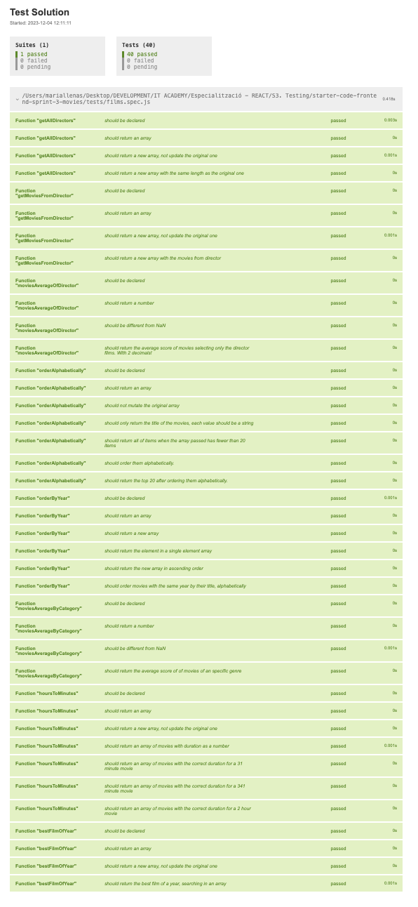

# Sprint 3 IT Academy | Testing with Jest

## Introduction

A company in the audiovisual sector has asked us for a web application that will allow their employees to quickly find movies from a large database they have since the process is currently done manually.


## Tests: 
Part of the exercise was to pass all the test implementing loops in  ES6 (map, reduce ,filter...).
To check all tests: 

```shell
$ npm install
$ npm run test
```

And last, execute `npm run test:watch` to generate a new file: `test-results.html` and open it with the "Live Server" VSCode extension to see test results.

This is an image from `test-results.html` where you can check that all tests have been passed: 



## Built with:


## Contributions: 

Contributions are welcome & appreciated by everyone!

If you would like to contribute, please follow these steps:

  1\. Fork the repository.  
  2\. Create a branch for your changes.  
  3\. Make your changes.  
  4\. Test your changes.  
  5\. Commit your changes.  
  6\. Push your changes to your fork.  
  7\. Open a pull request.


## Authors

- [@mllenas12](https://www.github.com/mllenas12)


